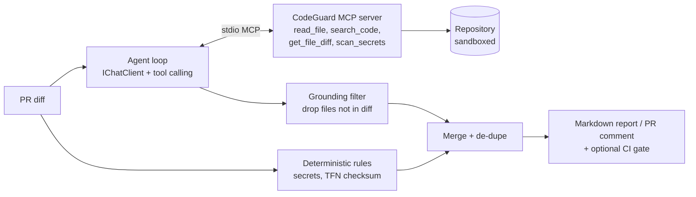

# 🛡️ CodeGuard — AI pull-request reviewer for .NET

An AI coding agent that reviews pull requests for security and quality issues relevant to
**Australian banking and insurance** (APRA CPS 234–inspired rules, Privacy Act / TFN handling, OWASP).

Built with **.NET 10**, the official **Model Context Protocol (MCP) C# SDK**, and **Microsoft.Extensions.AI**,
so the same code runs on a free local model, GitHub Models, or **Microsoft Foundry** (formerly Azure AI Foundry).



## What it demonstrates (your interview talking points)

| Skill | Where |
|---|---|
| Building an MCP server in C# | `src/CodeGuard.McpServer/RepoTools.cs` |
| Consuming MCP tools from an agent | `src/CodeGuard.Agent/McpConnection.cs` |
| Provider-agnostic LLM code (`IChatClient`) | `src/CodeGuard.Agent/ChatClientFactory.cs` |
| Tool-calling agent loop | `Reviewer.cs` (`UseFunctionInvocation`) |
| Hybrid AI: rules first, LLM second | `SecretScanner.cs` + `Reviewer.cs` |
| Hallucination control (grounding) | `Reviewer.cs` step 3 |
| Prompt-injection defence | `Prompts.cs` (diff treated as untrusted data) |
| Agent security (path traversal, git arg injection, ReDoS, exec opt-in) | `PathGuard.cs`, `RepoTools.cs` |
| Evals with precision / recall | `evals/cases`, `EvalRunner.cs` |
| Testing an agent without an LLM | `tests/.../ReviewerTests.cs` (fake `IChatClient`) |
| CI/CD for AI | `.github/workflows/` |

## Prerequisites

- .NET 10 SDK, Git
- One model provider (below)

```bash
dotnet build
dotnet test                       # 20 tests, no LLM needed
```

## Choose a model provider

| Provider | Cost | Best for |
|---|---|---|
| `ollama` | Free (runs on your PC) | Daily development |
| `github` | Free tier, rate-limited | CI and quick tests |
| `azure` | Pay per token (tiny for this project) | Portfolio demo on Microsoft Foundry |
| `none` | Free, no model at all | Offline / air-gapped runs: deterministic rules only (secrets, TFN checksum) |

### 1. Ollama (free, local)

```bash
# install from https://ollama.com, then pick a model that supports tool calling
ollama pull qwen2.5-coder:7b
export CODEGUARD_PROVIDER=ollama       # PowerShell: $env:CODEGUARD_PROVIDER="ollama"
```

On CPU-only machines a 7B model can take several minutes per call. Defaults are tuned for that
(10 min per request, no retries, 15 min per run); adjust with `OLLAMA_TIMEOUT_SECONDS`,
`CODEGUARD_TIMEOUT_MINUTES`, or a smaller `OLLAMA_MODEL` such as `qwen2.5-coder:3b`.

### 0. No model (rules only)

Nothing to install. Only the deterministic `SecretScanner` rules run, so the semantic rules
(SQL injection, missing `[Authorize]`, insecure deserialization, …) are not checked.

```bash
dotnet run --project src/CodeGuard.Agent -- review --repo . --provider none --diff-file evals/cases/02-hardcoded-secret/diff.patch
```

### 2. GitHub Models (free tier)

Create a fine-grained personal access token with the **Models: read** permission.

```bash
export CODEGUARD_PROVIDER=github
export GITHUB_TOKEN=github_pat_xxx
export GITHUB_MODEL=openai/gpt-4o-mini
```

### 3. Microsoft Foundry (your Azure project)

The Foundry portal itself is free; you pay only for model tokens. Keep it near-free:

1. **Credit:** a new Azure account includes trial credit (check the current offer on azure.microsoft.com/free).
2. **Budget alert first:** Cost Management → Budgets → e.g. A$5/month with email alerts at 50% and 100%.
3. **Deploy a small model:** in your Foundry project → *Models + endpoints* → deploy `gpt-4o-mini`
   (Global Standard, pay-as-you-go). No provisioned throughput.
4. **Copy the endpoint** from the resource overview, e.g. `https://<your-resource>.openai.azure.com`.
5. **Keyless auth (recommended):** give yourself the *Cognitive Services OpenAI User* (or *Azure AI User*) role on the resource, then `az login`.

```bash
export CODEGUARD_PROVIDER=azure
export AZURE_OPENAI_ENDPOINT=https://<your-resource>.openai.azure.com
export AZURE_OPENAI_DEPLOYMENT=gpt-4o-mini
# optional instead of az login:
# export AZURE_OPENAI_API_KEY=...
```

**Rough cost:** one review is typically ~5–15k input tokens + ~1k output. At gpt-4o-mini rates
that is well under one cent; a full eval run is a few cents. Delete the deployment when you're done.

## Run it

```bash
A=src/CodeGuard.Agent/bin/Debug/net10.0/CodeGuard.Agent.dll

# Explore the MCP tools with no LLM at all
dotnet $A tools --repo .
dotnet $A call  --repo . --tool read_file --args '{"path":"README.md","maxLines":5}'

# Review your current branch against main
dotnet $A review --repo /path/to/your/repo --base origin/main

# Review a patch file, fail the build on High or worse
dotnet $A review --repo . --diff-file evals/cases/01-sql-injection/diff.patch --fail-on High

# Measure quality
dotnet $A eval --repo . --out eval-results.md
```

## Evals

`evals/cases/*` holds seeded pull requests (SQL injection, hard-coded secret, BinaryFormatter,
missing `[Authorize]` on a transfers endpoint, TFN logging) plus one **clean** change to measure false positives.
A predicted finding counts as correct when rule ID and file match and the line is within ±3.

Add a case: create `evals/cases/NN-name/files/...`, a `diff.patch`, and `expected.json`.
Compare models and prompts by their precision/recall, and commit `eval-results.md` to your README.

## GitHub Actions

- `codeguard-pr-review.yml` reviews every PR using **GitHub Models with the built-in token** (`permissions: models: read`), so there are no secrets to manage, and upserts a single comment.
- `ci.yml` runs unit tests on every push and the eval suite on manual trigger.

Execution tools (`run_dotnet_build`, `run_dotnet_test`) are **off** unless `CODEGUARD_ALLOW_EXEC=true`.
Never enable them for untrusted PRs in a job that has a write token.

## Use the MCP server from VS Code / Copilot

`.vscode/mcp.json` registers the server, so GitHub Copilot agent mode (or any MCP client) can use
CodeGuard's tools directly.

## Next steps (to level up the project)

1. Inline PR review comments on exact lines (GitHub "create review" API) instead of one summary comment.
2. Structured outputs (JSON schema) where the provider supports it; compare parse-failure rates in evals.
3. OpenTelemetry tracing (`.UseOpenTelemetry()` on the chat client) and view traces in Foundry / App Insights.
4. Foundry evaluations and Azure AI Content Safety prompt shields on the input.
5. Model routing: a small model for triage, a larger model only for files with findings. Track cost per review.

> Rules are inspired by APRA CPS 234, the Privacy Act 1988 and OWASP for learning purposes; this is not compliance advice.
